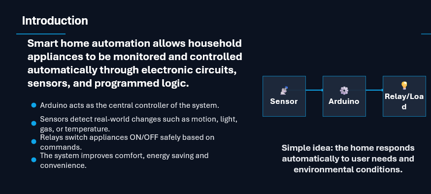
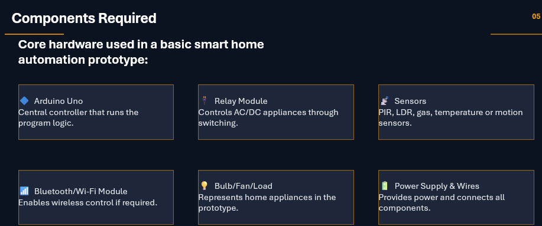

  

# 🏠 Smart Home Automation System using Arduino

A Bluetooth-based Smart Home Automation System developed using **Arduino Uno** and the **HC-05 Bluetooth Module**. This project allows users to wirelessly control household appliances using a smartphone, demonstrating the fundamentals of embedded systems and home automation.

---

# 📖 Project Overview

This project was developed as a **Personal Learning Project** to explore Arduino programming, Bluetooth communication, and automation technologies.

The system receives commands from an Android smartphone via Bluetooth. Arduino processes these commands and controls connected appliances through a relay module.

---

# 🎯 Objectives

- Design a low-cost home automation system.
- Control electrical appliances wirelessly.
- Learn Arduino programming and Bluetooth communication.
- Understand embedded systems and automation concepts.

---

# 🛠️ Components Used

- Arduino Uno
- HC-05 Bluetooth Module
- Relay Module
- LED / Bulb
- Fan (Optional)
- Jumper Wires
- Breadboard
- Power Supply

---

# ⚙️ Working Principle

1. The user sends commands from a smartphone.
2. The HC-05 Bluetooth module receives the commands.
3. Arduino processes the received data.
4. The relay switches appliances ON or OFF.
5. The user can control appliances wirelessly.

---

# 📸 Project Preview

## 🖼️ Cover Page

---

## 📘 Introduction

---

## ❗ Problem Statement

---

## 🔧 Components

---

## ⚡ Working Principle

---

# 💡 Features

- Wireless Bluetooth Control
- Arduino-Based Automation
- Low-Cost Solution
- Easy to Build
- Beginner Friendly
- Energy Efficient

---

# 🌍 Applications

- Smart Homes
- Home Automation
- Educational Projects
- IoT Learning
- Embedded Systems

---

# 🚀 Future Improvements

- Wi-Fi Control using ESP8266/ESP32
- Mobile Application
- Voice Assistant Integration
- IoT Cloud Monitoring
- Sensor-Based Automation

---

# 📂 Repository Contents

- 📄 Project Report (PDF)
- 📊 PowerPoint Presentation
- 🖼️ Project Images
- 💻 Arduino Source Code
- 🔌 Circuit Design

---

# 👩‍💻 Author

**Kanwal Shahzad**

BS Robotics Intelligence System Student

Bahria University

---

⭐ If you found this project helpful, consider giving it a Star!
